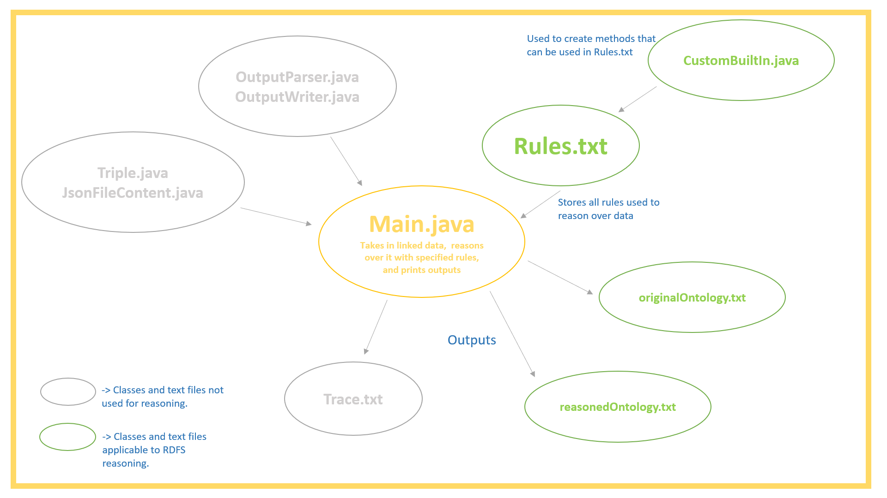

# RDFS Semantic Reasoner

### Contributers:
Brayden Pankaskie

### Purpose:
This Java RDFS reasoner was designed to be flexible, custamizable, scalable, and simple to understand.  It was built to accept a wide variaty of linked data and be able to present this data in a human readable form.

### Functions and Features:
* Accept and parse linked data of diverse rdf formats storing them as a querable graph.
* Convert any linked data graph to desired syntax.  (Turtle, N-Triples, NQuads, TriG, JSON-LD, RDF/XML, RDF/JSON, TriX, RDF Binary)
* Reason over linked data using comletely customized rule-set in forward, backward, or hibrid chaining.
* Create an accurate inference graph which is a full RDFS entailment of the original graph based on the RDFS entailment lema from the W3C website.

## Class Flow


## User Manual Summery
### Reading different files
To read a linked data file or change the file being read, enter the Main.java class and observe the string variable named ontologyFile at the top of the main method.  Next place the path of the file which is to be read and run the program.
### Altering rules
To alter the rules or rule-set the reasoner uses to infer new information, first go to the Rules.txt file.  All the rules and axioms which must be present for full RDFS reasoning are currently listed in this file but may be commented out using either two backslashed "//" or with a pound sign "#".  Existing rules may be changed or new rules added by following the Apache Jena Documentation for [general purpose rule engines](https://jena.apache.org/documentation/inference/index.html#rules).
### Changing output syntax
```java
ontModel.write(originalOut, "TURTLE");
```
The code above was taken from the Main class and uses the Jena method write() to print the graph "ontModel" to a file specified by the PrintWriter "originalOut" in "TURTLE" format.  "System.out" can replace the "originalOut" if printing to the console is desired.  To change the output format simply replace the "TURTLE" with any of the below formats.
Writer Name | RDF Format
------------|-----------
"TURTLE"    |	TURTLE
"TTL"       |	TURTLE
"Turtle"	  | TURTLE
"N-TRIPLES" |	NTRIPLES
"N-TRIPLE"  |	NTRIPLES
"NT"        |	NTRIPLES
"JSON-LD"   |	JSONLD
"RDF/XML-ABBREV" | RDFXML
"RDF/XML"   |	RDFXML_PLAIN
"N3"        |	N3
"RDF/JSON". | JSON
### Custom Builtin
A custom builtin is a java class which enables the user to create custom methods which can be used in the Rule.txt file.  This is very useful when a function is required that Jena has not already implemented.  For a list of methods already implemented by Jena and for more documentation on creating custom builtins see, [Builtin Primative](https://jena.apache.org/documentation/inference/index.html#RULEbuiltins) and [Builtin Extentions](https://jena.apache.org/documentation/inference/index.html#RULEextensions). This class must also be registered before it can be used which is accomplished using the following code:
```java
BuiltinRegistry.theRegistry.register(new ClassName());
```
where "ClassName" is the name of the new class.

#### Other Helpful Documenation
* [Apache Jena Documentation](https://jena.apache.org/documentation/)
provides direction on how to use Jena, an API which contains many semantic tools and methods.
* [W3C Documentation](https://www.w3.org/TR/rdf-mt/#rules)
provides all rules, entailment lemas, and standards which must be adhered to.
